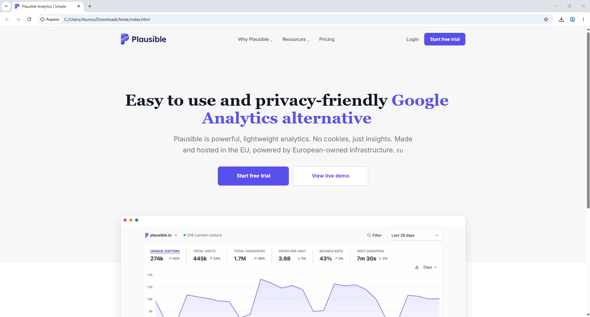

<h1 align="center">Plausible Analytics (Clone Acadêmico)&nbsp; 
  
  
</h1>

## 📌 Sobre o Projeto
Este repositório contém o desenvolvimento de um site inspirado na plataforma Lausibl Analytics, criado exclusivamente para fins acadêmicos.

O objetivo é recriar a interface visual da plataforma, focando na estrutura, design e organização dos elementos, sem implementação de funcionalidades interativas.

---

## 🎯 Objetivo
- Praticar fundamentos de desenvolvimento web  
- Trabalhar com estruturação em HTML  
- Aplicar estilização com CSS  
- Desenvolver noções de layout e responsividade  
- Simular uma interface real de sistema  

---

## 🛠️ Tecnologias Utilizadas
- HTML5  
- CSS3  

---

## 👥 Integrantes
Projeto desenvolvido em dupla como atividade escolar.
- João Pedro Magri Martins | Github: Jpmagri-07
- Miguel Perino | Github: MiguelPerino

---

## 🚫 Limitações
- Projeto estático (sem JavaScript)  
- Sem backend ou banco de dados  
- Sem funcionalidades dinâmicas  

---

## 📷 Preview do Projeto

  

---

## 📚 Finalidade
Este projeto tem caráter exclusivamente educacional, não possuindo qualquer vínculo oficial com a plataforma original.
